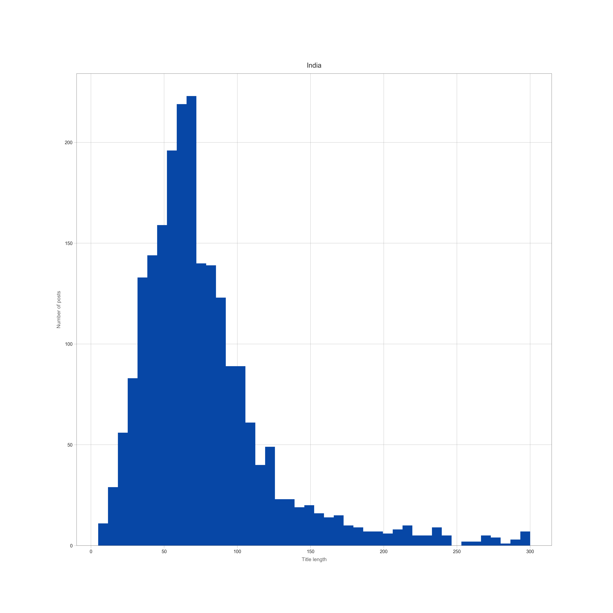
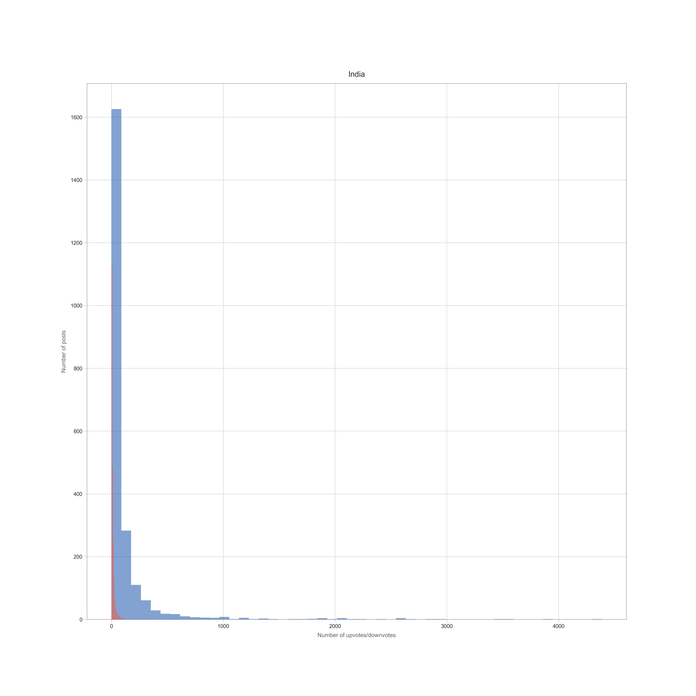
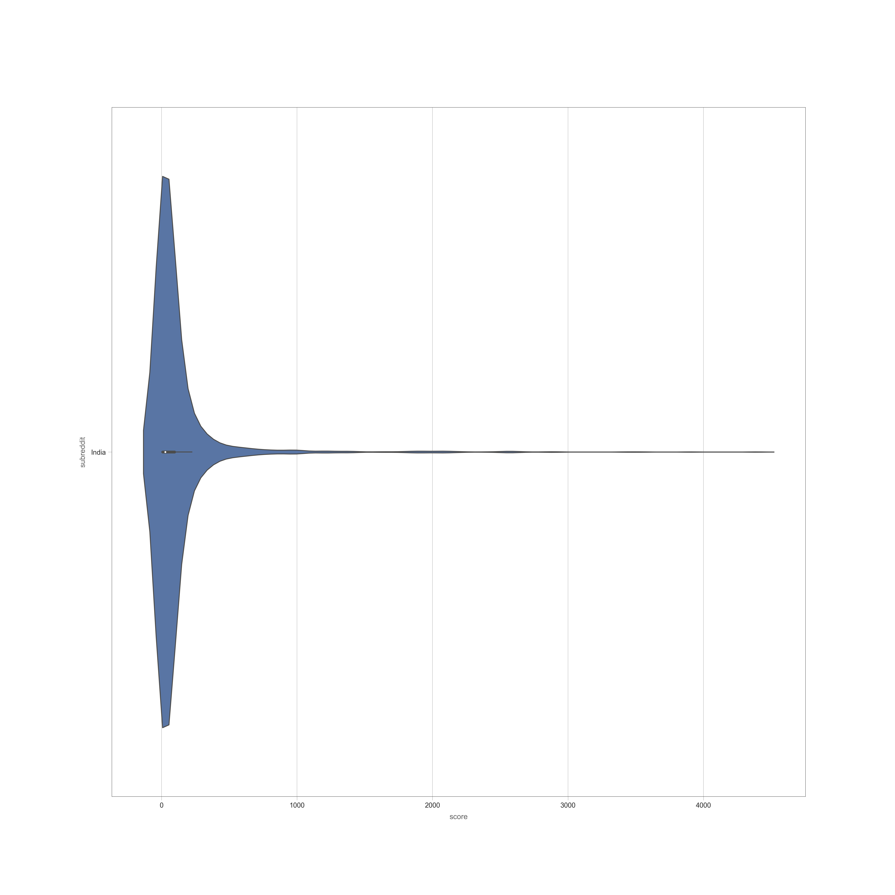
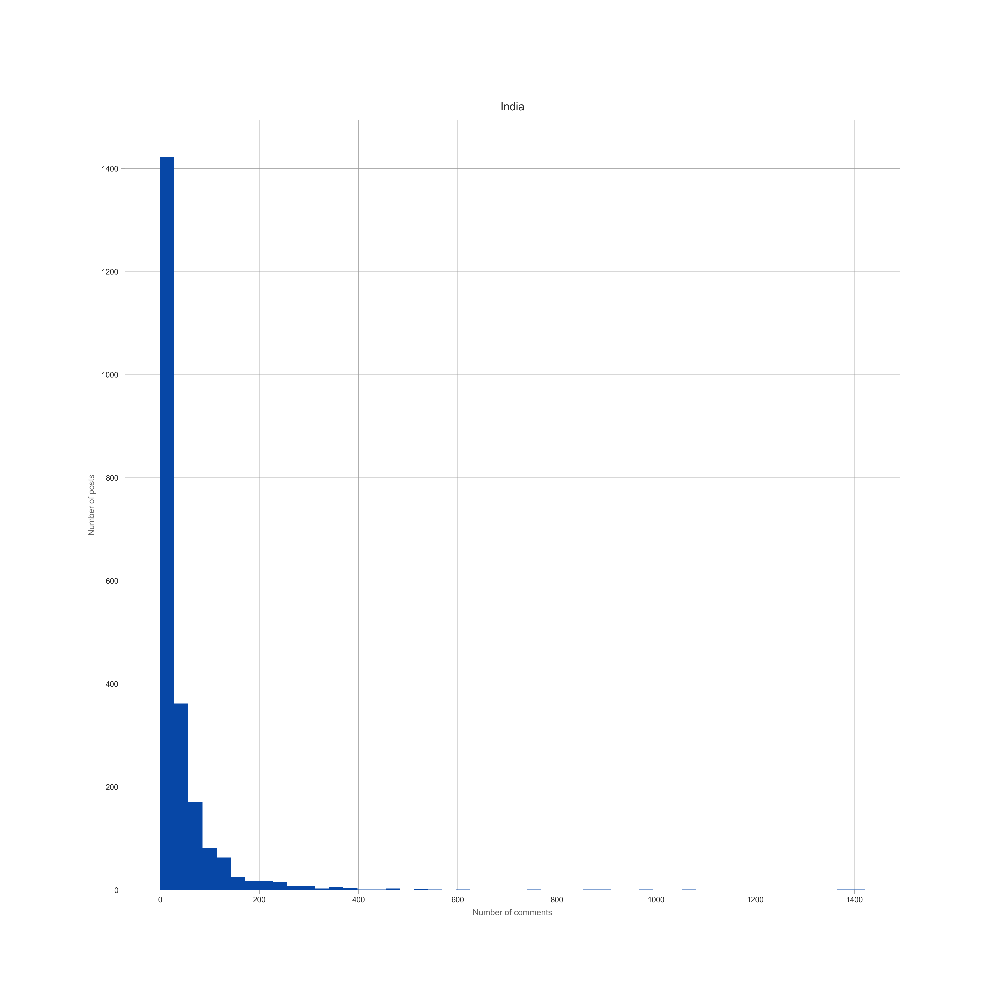
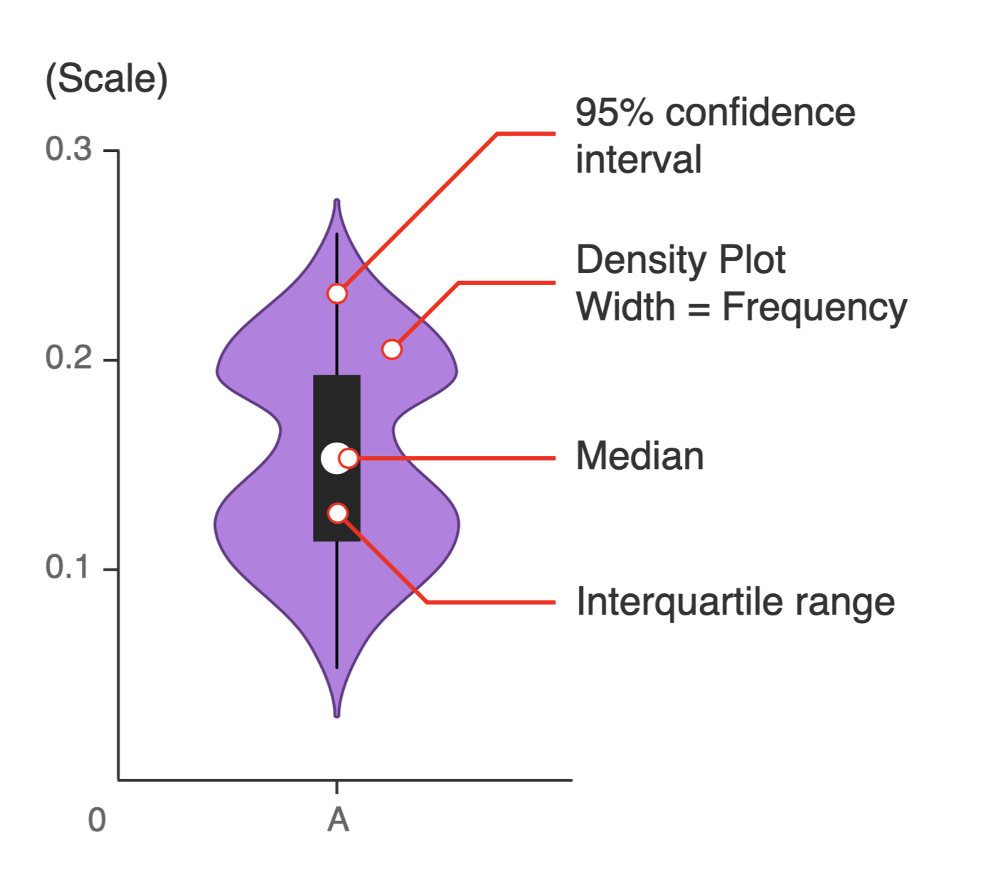

# Reddit Flair Predictor

[Project Hosted on : ](https://precog-final-manthan.herokuapp.com/)

[Machine Learning Model: ](https://drive.google.com/file/d/1C_sxTrOCIoiqIPBieokMOYtD-JxmJCgE/view?usp=sharing)

### Technologies Used:
* Frontend - HTML/CSS
* Backend - Flask
* Database - Direct CSV import from pandas library
* APIs - Reddit API, PRAW Model 

### Project Screenshots on LocalHost

### Data Analysis with collected data

